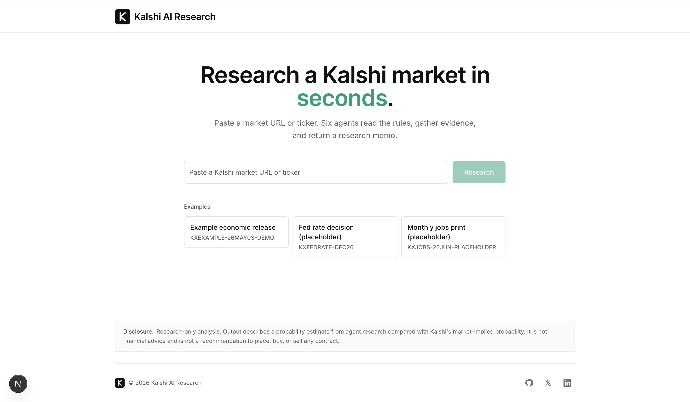

# Probable



Probable is an event-probability predictor and explainer. Paste a Kalshi market ticker or URL and watch a live research pass run: market context, settlement-rule audit, public evidence, a bounded probability estimate, and a skeptic's calibration — streamed to the screen as it happens, ending in a validated research memo.

> [!IMPORTANT]
> Research assistance only. Probable does not execute trades, place orders, manage portfolios, or provide financial advice.

## How it works

```text
React SPA (Vite + Tailwind + motion)      FastAPI engine (workflow-python/)
┌─────────────────────────────┐           ┌────────────────────────────────┐
│ prompt → live analysis view │  SSE      │ AnalysisEngine pipeline        │
│ stage rail · findings feed  │◄──────────│  EventSource seam (Kalshi)     │
│ probability dial · memo     │           │  settlement audit · Tavily     │
└─────────────────────────────┘           │  Gemini estimator · AG2 skeptic│
                                          └────────────────────────────────┘
```

The engine researches one event per request and yields typed Analysis Events (stage transitions, sources, evidence, settlement risks, warnings, estimate updates) over `GET /analyze/stream`, ending with the validated Workflow Response Contract. The blocking `POST /analyze` endpoint consumes the same pipeline. Demo mode replays a fixture through identical event shapes, so the full animated experience works without provider keys.

The event-source seam is source-agnostic: Kalshi is the first implementation, and a free-text event resolver can plug in later without touching the engine loop.

## Prerequisites

- Node.js 22+
- Python 3.12+ with `uv`

## Frontend

```bash
npm install
npm run dev        # http://localhost:5173
npm run check      # typecheck + lint + format + tests
```

`VITE_API_BASE_URL` points the SPA at the engine (defaults to `http://127.0.0.1:8000`).

## Engine

```bash
cd workflow-python
uv sync --dev
uv run uvicorn app.main:app --reload   # http://127.0.0.1:8000
scripts/check                          # lock + ruff + mypy + pytest
```

Environment (repo-root `.env` or `workflow-python/.env`):

- `GEMINI_API_KEY` — probability estimator (OpenRouter `sk-or-…` keys are auto-detected).
- `TAVILY_API_KEY` — evidence search. Without it, live mode is unavailable; demo mode always works.
- `WORKFLOW_AG2_ENABLED=true` — enables the AG2 skeptic calibration pass.
- `WORKFLOW_CORS_ALLOW_ORIGINS` — JSON list of allowed browser origins.

Try the stream directly:

```bash
curl -N "http://127.0.0.1:8000/analyze/stream?input=KXEXAMPLE-26MAY03-DEMO&demo=true"
```

## Repository shape

```text
src/                     React SPA (contracts, features/analysis, components)
workflow-python/         FastAPI analysis engine (engine, sources, tools, contracts)
docs/work/               Local-first spec/ticket tracker (see docs/agents/issue-tracker.md)
.agents/skills/          Agent skills (hub-managed + repo-local)
```

Work ships via pull request; `.github/workflows/checks.yml` runs both gates.
